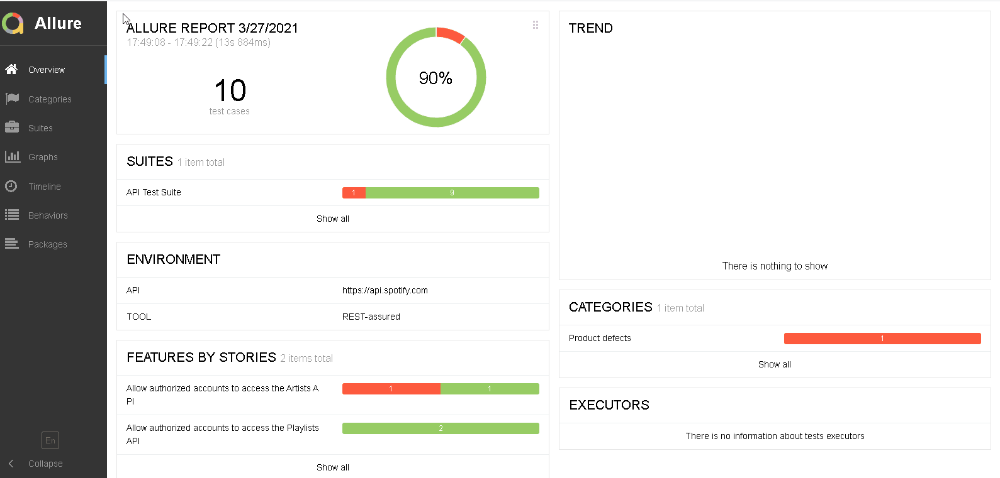

# music-RESTassured-java

Maven project using REST-assured + Java + TestNG + Jackson + Allure + Selenium

For this small API testing project, I decided to go with :drum: [Spotify](https://www.spotify.com/ca-en/)! Why? Simply because I like listening to music and I've been using their Web Player for about five years now. Also, given the fact that their [Web API](https://developer.spotify.com/documentation/web-api/) is well documented, it made learning and practicing REST-assured a lot easier for me. I have implemented test cases with two different approaches. The first one uses the *Behavior Driven Development (BDD)* style in which `Given`, `When` and  `Then` keywords are used along with `Matchers`. While the second follows the REST-assured legacy syntax with `given()`, `expect()`, and `when()` methods.

## Contents

 - [Tools](#tools)
 - [Framework](#framework)
 - [Installation](#installation)
    - [Prerequisites](#prerequisites)
    - [How to install](#how-to-install)
    - [How to run](#how-to-run)
 - [Sources](#sources)
 - [Contact](#contact)

## Tools

- Eclipse IDE 2020-09 (Java 8)
- Maven (dependency management)
- REST-assured (api automation framework)
- TestNG (testing framework)
- Selenium WebDriver (web automation framework)
- Allure Framework (test report generation)

## Framework

The Spotify Web API offers four different [authorization flows](https://developer.spotify.com/documentation/general/guides/authorization-guide/#authorization-flows), but I decided to implement one of them which is the **Authorization Code Flow with Proof Key for Code Exchange (PKCE)** because it provides the `refresh_token` without exposing the `client_secret`. Since the user interaction is needed, I initially went with the `HtmlUnitDriver` because it's fast and doesn't require a browser binary, but due to performance issue, I switched to `ChromeDriver` in headless mode. By default, each test case uses the `access_token`, which comes with all scopes, generated in the `@BeforeSuite` method, but they can obtain their own with different scopes and thus without overriding the `static` one.

<ins>The framework implements the following:</ins>

1. Access and refresh tokens are programmatically generated with the help of Page Object Model (POM)
2. Authentication flow can be executed in parallel
3. Builder pattern to construct the authorization URI with different set of query parameters
4. Data-driven approach to increase test coverage
5. End-to-end (E2E) testing
6. Exception handling with `try/catch` block
7. Integration with Allure for a prettier test report
8. Project structure follows good practices
9. Reusable request and response specifications
10. etc.

<ins>Here are the points I took in consideration when testing endpoints:</ins>

- Scope access
- Correct status code
- Data validation
  - Size
  - Key is present
  - Value
- Schema validation
  - Order
  - Type
  - Missing required
  - etc.
- Response time

*Note: To keep the project small, I decided to not verify the authentication/authorization flow. Also, pagination tests are not part of the testing scope.*

## Installation

### Prerequisites:

- Mandatory
  - Java 8 or later (JDK)
  - Maven
  - Spotify account (any plan) with an APP (Spotify for Developers)
    - In your APP settings, enter the following for the **Redirect URIs** field: `http://lvh.me`. This domain always points to `127.0.0.1`, which is your computer local IP address, and will help us to obtain valid access and refresh tokens.
  - In the project folder, inside the `test-config.properties` file under the `src/test/resources/com/api/config` package, add your Spotify email or username, password, user<sup>1</sup> and client id<sup>2</sup> in their respective field.
- Optional
  - Allure Framework
  - Java IDE
  - TestNG plugin
  - Git Bash

<sup>1</sup>The user id is the same as your username which can be found in your Account overview page.

<sup>2</sup>The client id can be found by clicking your APP on the Spotify for Developers Dashboard page.

### How to install:

Enter the following command in Git Bash:

```bash
$ git clone https://github.com/mk-sdet/music-RESTassured-java.git
```

Or download the repo and unzip it anywhere on your machine.

### How to run:

In Eclipse IDE, right-click the `testng.xml` file and under "<ins>R</ins>un As" choose "<ins>1</ins> TestNG Suite".

<p align="center">OR</p>

In IntelliJ IDEA, right-click the `testng.xml` file and choose "R<ins>u</ins>n PATH".

<p align="center">OR</p>

In `cmd`/`terminal`, run the following maven command inside the project directory:

```bash
mvn clean test -DsuiteXmlFile=testng.xml
```

To view the report, simply navigate to the `target` folder and generate it with these two simple commands:

```bash
cd target
allure serve
```

<p align="center"></p>

I purposely failed one test case to show how Allure displays failed tests.

<h2 align="center">That's all! By the way, what is your favorite musical instrument emoji?<br />
  Banjo :banjo:<br />
  Drum :drum:<br />
  Guitar :guitar:<br />
  Horn :postal_horn:<br />
  Musical Keyboard :musical_keyboard:<br />
  Saxophone :saxophone:<br />
  Trumpet :trumpet:<br />
  Violin :violin:
</h2>

## Sources

[Code Challenge algorithm](https://www.appsdeveloperblog.com/pkce-code-verifier-and-code-challenge-in-java/)

## Contact

Created by [Muana Kimba](https://www.linkedin.com/in/mkimba)
